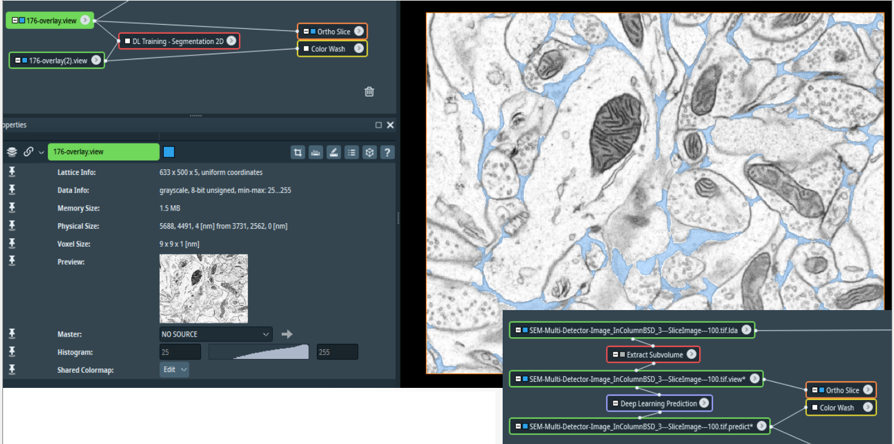
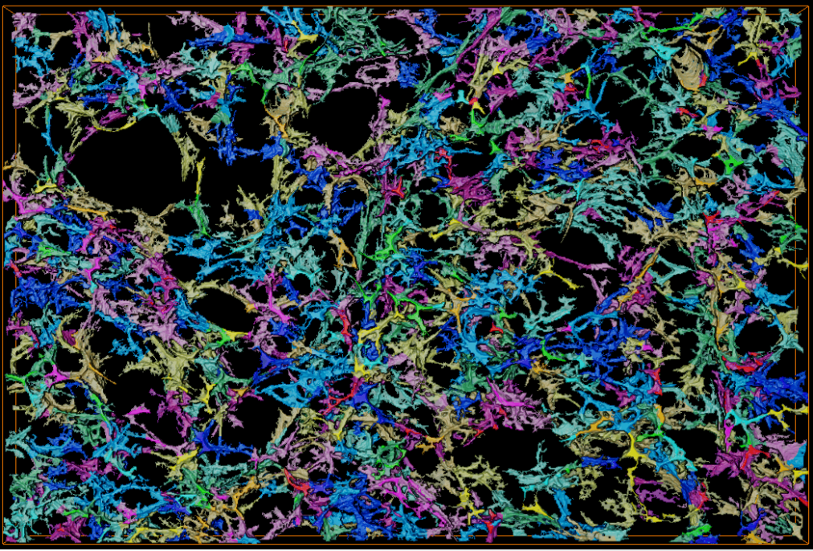

# ECS-Net

**ECS-Net software** is the Pytorch implementation for high throughput quantification of brain extracellular space segmentation. This repository is developed based on the under review paper [**ECS-Net: Extracellular space segmentation with shape-aware and contrastive loss by using cryo-electron microscopy imaging**](https://).<br>

Author: Chuqiao Yang<sup>1,2†</sup>, Jiayi Xie<sup>3†</sup>, Xinrui Huang<sup>4†</sup>,Hanbo Tan<sup>1,2</sup>, Qingyuan He<sup>5</sup>,Junhao Yan<sup>6</sup>, Hongfeng Li<sup>1</sup>, Qirun Li<sup>1</sup>, Guangkun Nie<sup>1</sup>, Wanyi Fu<sup>7</sup>, Zhaoheng Xie<sup>1</sup>,Yao Sui <sup>1</sup>,Yanye Lu<sup>1*</sup> and Hongbin Han<sup>1,2,5,8*</sup>

<sup>1</sup>Institute of Medical Technology, Peking University Health Science Center, Beijing, 100191, China. \
<sup>2</sup>Beijing Key Laboratory of Magnetic Resonance Imaging Technology, Beijing, 100191, China.\
<sup>3</sup>Department of Automation, Tsinghua University, Beijing, 100084, China.\
<sup>4</sup>Department of Biophysics, School of Basic Medical Sciences, Peking University, Beijing, 100191, China.\
<sup>5</sup>Department of Radiology, Peking University Third Hospital, Beijing, 100191, China.\
<sup>6</sup>Department of Human Anatomy, Histology and Embryology, School of Basic Medical Sciences, Peking University Health Science Center, Beijing, 100191, China.\
<sup>7</sup>Department of Electronic Engineering, Tsinghua University, Beijing, 100084, China.\
<sup>8</sup>Institute of Biomedical Engineering, Peking University Shenzhen Graduate School, Shenzhen, 518071, China


<sup>†</sup>These authors contributed equally. \
<sup>*</sup>Corresponding author.

## Abstract
> The transport of molecules within the brain extracellular space (ECS) plays a pivotal role in governing sleep patterns, memory formation, and the aging process in organisms. Isolating and delineating the ECS is crucial for constructing accurate models of molecular dynamics within the intricate neuronal networks. However, the segmentation of the ECS has proven to be a formidable challenge due to its complex morphology, and there is a notable lack of comprehensive studies on such topic. In this study, we have constructed an exclusive dataset for ECS segmentation, utilizing an advanced imaging technique enabled by cryo-electron microscopy. We introduce ECS-Net, a dedicated segmentation pipeline that integrates contrastive learning approach and shape-aware function. The contrastive learning strategy is employed to effectively differentiate the extracellular space from surrounding neural elements, while the shape-aware function is designed to bolster the model’s sensitivity to the distinctive structures of the ECS. The experimental results indicate that ECS-Net significantly outperforms existing methods in ECS segmentation. Moreover, our model exhibits robust generalization capabilities when applied to an independent validation dataset. In summary, this study marks the establishment of the first cascaded network tailored for brain ECS segmentation. Our method is poised to enhance the analysis of ECS structures within extensive datasets, thereby offering a substantial contribution to the broader biomedical research community.

## :star: Version of ECS-Net
In order to allow more users to utilize ECS-Net, we currently provide two ways to use the software. The first option is for those users who can directly use our models and algorithms through programming, which requires professional computational personnel. The other method is to integrate ECS-Net into AMIRA, a popular commercial software for electron microscopy image analysis. We have detailed the procedures for installing and implementing ECS-Net on AMIRA.  

## Contents
- [Environment](#environment)
- [Train a new model](#train-a-new-model)
- [Test pre-trained models](#test-pre-trained-models)
- [Install operating environment for ECS-Net in Amira](#install-operating-environment-for-ecs-net-in-amira)
- [License](#license)
- [Citation](#citation)

## Environment
- Ubuntu 16.04
- CUDA 11.7
- cuDNN 8.4
- Python 3.9
- Torch 2.0
- GPU: >= NVIDIA GeForce RTX 3090
    ```
    pip install -r requirements.txt
    ```

## Train a new model
- Data for training: You can train a new model using your own datasets. Note that you'd better divide the dataset of each specimen into training part and validation/testing part before training, so that you can test your model with the preserved validation/testing data.
- Data preprocess: run `python shape_weight_new.py` to creat shape map of datasets. Before running, you should check image paths and some parameters following the instructions. After running, the data is saved in source path by default.
- Run `python main.py` in your terminal to train a new model. Similar to testing, before running the bash file, you should check if the data paths and the arguments are set correctly


## Test pre-trained models
- Download pre-trained models and place them in `./models`.
- Open your terminal and cd to ECS-Net.
- Run `python test.py` in your terminal. Note that before running the bash file, you should check if the data paths and other arguments are set correctly.
- The output images will be saved in `./result`.


## Install operating environment for ECS-Net in Amira
The primary objective of this method is to assist researchers in accessing the user-friendly GUI of ECS-Net for high-throughput quantification of the extracellular space. We have integrated ECS-Net into Amira, a popular commercial software for electron microscopy image analysis. This method will guide you through the process of incorporating ECS-Net into the AI module of Amira, then invoking the ECS-Net functions on Amira's user-friendly GUI, and finally outputting visual and statistical results through automatic segmentation by ECS-Net.

- Click menu bar Python” -> “Environment” -> "Create New Environment".
- Type “ECS-Net” as the title of the new environment in the input frame as indicated below, then Click “OK”.
- The command-line interface popup and the basal environmental will be installed automatically.
- After the creation of ECS-Net environment, select “Python”->“Environment” ->ECS-Net, restart of Amira will be required, and the ECS-Net environment will come into operation after the restart of Amira.
- Decompress and open installation package of ECS-Net.
- Open installation directory, decompress and open installation package of ECS-Net software, copy the 3 files in 3 folders under the ECS-Net package to the corresponding
homonymous folders in the installation directory, restart Amira to complete the ECS-Net installation.
- Download model files of ECS-Net, and copy the files to the folder .\ECS-Net\checkpoint.
- Restart Amira to use the models.

Please refer to the official website: https://www.thermofisher.cn/cn/en/home/electron-microscopy/products/software-em-3d-vis/amira-software.html


<!-- <br>
<p align="center"></p> -->

<!-- <br>
<p align="center"></p> -->

## License
This repository is released under the (LICENSE) License (refer to the LICENSE file for details).

## Citation
If you find the code or dataset helpful in your resarch, please cite the following paper:
```

```
## Supplementary statement
More detailed content will be organized and published after the paper is accepted, thanks for your attention...
